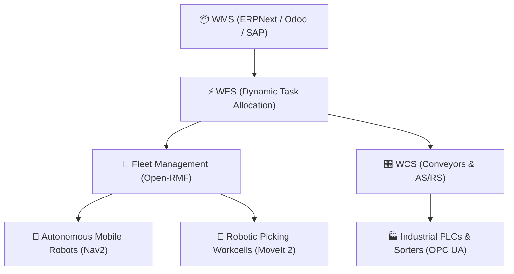

<p align="center">
  
</p>

<h1 align="center">🤖 Awesome Warehouse Automation 📦</h1>

<p align="center">
  <strong>A curated list of top SaaS platforms, open-source software, robotics frameworks, and autonomous systems powering modern warehouse intralogistics.</strong>
</p>

<p align="center">
  <a href="https://github.com/ishandutta2007/Awesome-Awesome-Awesome"></a><a href="https://discord.gg/jc4xtF58Ve"></a>
  <a href="https://github.com/ishandutta2007/Awesome-Warehouse-Automation/stargazers"></a>
  <a href="https://github.com/ishandutta2007/Awesome-Warehouse-Automation/network/members"></a>
  <a href="https://github.com/ishandutta2007/Awesome-Warehouse-Automation/blob/main/LICENSE"></a>
  <a href="https://github.com/ishandutta2007/Awesome-Warehouse-Automation/pulls"></a>
  <a href="https://github.com/ishandutta2007"></a>
</p>

---

## 🌟 Overview & SEO Summary

**Warehouse Automation** encompasses cutting-edge technologies that automate warehouse storage, retrieval, picking, sortation, replenishment, pallet handling, and order fulfillment. This repository tracks commercial **SaaS/Hosted Platforms** and high-impact **Open-Source GitHub Projects** across:

- 🤖 **Autonomous Mobile Robots (AMRs) & Automated Guided Vehicles (AGVs)**
- 🏗️ **Automated Storage and Retrieval Systems (AS/RS) & Goods-to-Person (GTP)**
- 🦾 **Robotic Manipulation, Piece Picking & 6-DoF Grasping**
- 🛰️ **Multi-Robot Fleet Management, Traffic Negotiation & Open-RMF Orchestration**
- 🗺️ **SLAM, 2D/3D LiDAR Perception, ROS 2 Navigation (Nav2) & Digital Twins**
- 📊 **Warehouse Execution Systems (WES), Warehouse Control Systems (WCS) & WMS ERP**

---

## 📑 Table of Contents

- [🏢 SaaS & Hosted Platforms](#-saashosted-platforms)
- [⭐ Open-Source GitHub Projects](#-open-source-github-projects)
- [🧩 Recommended Open-Source Stacks](#-recommended-open-source-stacks)
- [🧱 Warehouse Automation Building Blocks](#-warehouse-automation-building-blocks)
- [📚 Key Intralogistics & Robotics Concepts](#-key-intralogistics--robotics-concepts)
- [🤝 How to Contribute](#-how-to-contribute)
- [📈 Star History](#-star-history)
- [⚠️ Disclaimer](#-disclaimer)

---

## 🏢 SaaS/Hosted Platforms

The commercial warehouse automation market is led by enterprise robotics vendors providing turnkey hardware, cloud orchestration platforms, and Robots-as-a-Service (RaaS) subscription tiers.

*Sorted in descending order by company size (Revenue / Market Capitalization / Valuation).*

| Platform | Company Size (Valuation / Revenue) | Description / Core Capability | Starting Pricing | Free Tier / Trial Limits |
| :--- | :--- | :--- | :--- | :--- |
| **[Dematic](https://dematic.com/)** | **$12.5B+ Revenue** (Parent KION Group / ~$4B+ Division) | Enterprise automated material handling, automated guided vehicles (AGVs/AMRs), sortation, and Dematic iQ WES/WMS. | **Dematic iQ / RaaS:** From ~$3,500/month per robot / WES software tier (turnkey installations from ~$250,000+) | **30-day digital-twin emulation study** (limited to 1 facility workflow simulation; no perpetual free tier) |
| **[Swisslog](https://swisslog.com/)** | **$4.2B+ Revenue** (KUKA Group / ~$1.2B+ Division) | Automated warehouse logistics, AS/RS integration, Vectura cranes, and SynQ WMS/WCS software. | **SynQ SaaS:** From ~$4,000 – $8,000/month (turnkey hardware/software integration from ~$150,000+) | **14-day guided sandbox access** during solution discovery and architecture validation (no perpetual free tier) |
| **[AutoStore](https://www.autostoresystem.com/)** | **~$5.5B Market Cap** ($650M+ Annual Revenue) | Ultra-dense cube-based automated storage and retrieval system (AS/RS) with high-speed grid robots. | **Pay-Per-Pick / RaaS:** ~$0.05 – $0.15/bin pick + 20–40% initial grid setup (turnkey entry systems from ~$1,000,000) | **1-day guided live test session** & custom StoreX digital simulation report (no perpetual free tier) |
| **[Fetch Robotics](https://fetchrobotics.com/)** | **$4.8B Revenue** (Parent Zebra Technologies / $305M Acquisition) | Autonomous industrial mobile robots for material transport, cart connect, and pallet handling via FetchCore cloud. | **RaaS:** ~$2,000 – $3,000/month per robot (capital purchase from ~$25,000/AMR + FetchCore SaaS from ~$150/robot/month) | **30-day proof-of-concept trial** (limited to 1–2 robots on a single floor loop; no perpetual free tier) |
| **[6 River Systems](https://www.6river.com/)** | **$3.5B Revenue** (Parent Ocado Group / $450M Initial Acquisition) | Collaborative AMR fulfillment platform ("Chuck") featuring directed workflows and cloud fleet orchestration. | **RaaS:** ~$2,500 – $4,500/month per robot (capital purchase from ~$30,000/AMR + software subscription) | **30-day structured pilot deployment** (limited to 2–4 Chuck AMRs in a single fulfillment zone; no perpetual free tier) |
| **[Körber Supply Chain](https://koerber-supplychain.com/)** | **$3.2B Revenue** (Parent Körber AG / ~$1.1B+ Division) | Unified supply-chain software suite (Körber One / K.Motion WMS/WCS/WES) and robotics orchestration. | **Cloud WMS SaaS:** From ~$1,500 – $3,000/month (entry tier covering 10–25 named users at ~$120–$180/user/month) | **14-day staging environment sandbox** (limited to preloaded sample warehouse datasets; no perpetual free tier) |
| **[Exotec](https://www.exotec.com/)** | **$2.0B Valuation** (Series E Unicorn / $300M+ Revenue) | Goods-to-person Skypod 3D climbing AMR storage and retrieval system for high-velocity order fulfillment. | **Modular Turnkey:** From ~$1,500,000 for Skypod Compact (peak-season RaaS robot additions from ~$3,500/robot/month) | **1-day scheduled demonstration & digital twin analysis** at regional Exotec Demo Centers (no perpetual free tier) |
| **[Locus Robotics](https://locusrobotics.com/)** | **$2.0B Valuation** (Series F Unicorn / $150M+ ARR) | Autonomous mobile robot (AMR) platform for collaborative fulfillment, picking, and orchestration. | **RaaS:** ~$2,000 – $3,500/month per robot (base unit purchase option from ~$35,000/robot) | **30-day on-site pilot program** (limited to a designated warehouse zone & 2–4 test robots; no perpetual free tier) |
| **[Geek+](https://www.geekplus.com/)** | **$2.0B Valuation** (Unicorn / $200M+ Revenue) | Autonomous mobile robots for goods-to-person picking, smart sorting, RoboShuttle AS/RS, and material handling. | **RaaS:** ~$2,200 – $4,000/month per robot (capital purchase from ~$20,000 – $35,000/unit + RMS software fees) | **30-day pilot testing program** (limited to a designated test cell with 2–5 AMRs; no perpetual free tier) |
| **[GreyOrange](https://www.greyorange.com/)** | **$750M Valuation** (Series D / $80M+ ARR) | AI-driven warehouse orchestration platform (GreyMatter) and goods-to-person Ranger AMR systems. | **RaaS:** ~$3,000/month per robot; GreyMatter cloud starting tier from ~$25,000/year (GreyMatter Foundry simulation from ~$5,000/project) | **30-day simulation pilot** via GreyMatter Foundry digital twin (limited to 1 facility layout; no perpetual free tier) |

---

## ⭐ Open-Source GitHub Projects

Curated open-source projects covering robot operating systems, navigation, manipulation, multi-robot fleet management, SLAM, computer vision, industrial IoT, optimization, and WMS.

*Sorted in descending order by GitHub Stars.*

| Project | Stars | Primary Domain | Description |
| :--- | :---: | :--- | :--- |
| **[OpenCV](https://github.com/opencv/opencv)** | [](https://github.com/opencv/opencv/stargazers) | 👁️ Computer Vision | Real-time computer vision library for barcode detection, item localization, and visual camera perception. |
| **[Segment Anything](https://github.com/facebookresearch/segment-anything)** | [](https://github.com/facebookresearch/segment-anything/stargazers) | 🎯 AI Segmentation | Foundation model for zero-shot object segmentation in robotic picking and warehouse item inspection. |
| **[Odoo](https://github.com/odoo/odoo)** | [](https://github.com/odoo/odoo/stargazers) | 📦 Open-Source WMS / ERP | Enterprise business suite featuring warehouse routing, barcode scanning, and multi-location inventory. |
| **[Ultralytics YOLO](https://github.com/ultralytics/ultralytics)** | [](https://github.com/ultralytics/ultralytics/stargazers) | 🔍 Object Detection | Real-time deep learning model for detecting pallets, packages, AMRs, racks, forklifts, and warehouse workers. |
| **[ERPNext](https://github.com/frappe/erpnext)** | [](https://github.com/frappe/erpnext/stargazers) | 🏢 Inventory & WMS ERP | Modern web ERP/WMS with stock ledger, batch numbering, serial tracking, and automated reorder triggers. |
| **[Google OR-Tools](https://github.com/google/or-tools)** | [](https://github.com/google/or-tools/stargazers) | ⚡ Operations Research | Fast optimization suite for vehicle routing (VRP), pick-path optimization, dynamic task assignment, and bin packing. |
| **[Open3D](https://github.com/isl-org/Open3D)** | [](https://github.com/isl-org/Open3D/stargazers) | 🌐 3D Point Clouds | 3D data processing library for point clouds, RGB-D perception, mesh reconstruction, and volumetric spatial analysis. |
| **[Google Cartographer](https://github.com/cartographer-project/cartographer)** | [](https://github.com/cartographer-project/cartographer/stargazers) | 🗺️ 2D/3D SLAM | Real-time Simultaneous Localization and Mapping system across 2D/3D LiDAR sensors for mobile robot fleets. |
| **[Intel RealSense SDK](https://github.com/IntelRealSense/librealsense)** | [](https://github.com/IntelRealSense/librealsense/stargazers) | 📷 Depth Sensing | Cross-platform SDK for depth cameras used on AMRs, robotic piece-picking arms, and dimensioning stations. |
| **[BehaviorTree.CPP](https://github.com/BehaviorTree/BehaviorTree.CPP)** | [](https://github.com/BehaviorTree/BehaviorTree.CPP/stargazers) | 🌲 Behavior Trees | C++ engine for flexible execution of robot navigation, pick-and-place workflows, and fault recovery. |
| **[Nav2 (Navigation 2)](https://github.com/ros-planning/navigation2)** | [](https://github.com/ros-planning/navigation2/stargazers) | 🧭 Autonomous Navigation | Complete ROS 2 navigation system for AMRs with costmaps, behavior trees, collision avoidance, and planners. |
| **[Eclipse Zenoh](https://github.com/eclipse-zenoh/zenoh)** | [](https://github.com/eclipse-zenoh/zenoh/stargazers) | 📡 Edge & Cloud Telemetry | Ultra-low latency pub/sub and query protocol for edge-to-cloud robot communication and ROS 2 bridges. |
| **[SLAM Toolbox](https://github.com/SteveMacenski/slam_toolbox)** | [](https://github.com/SteveMacenski/slam_toolbox/stargazers) | 🗺️ 2D LiDAR SLAM | Production-grade 2D LiDAR SLAM package optimized for large-scale industrial warehouse mapping. |
| **[Grid Map](https://github.com/ANYbotics/grid_map)** | [](https://github.com/ANYbotics/grid_map/stargazers) | 🗺️ Elevation Mapping | Multi-layered 2.5D grid mapping framework for robot terrain traversability, elevation maps, and obstacles. |
| **[MoveIt 2](https://github.com/ros-planning/moveit2)** | [](https://github.com/ros-planning/moveit2/stargazers) | 🦾 Robotic Manipulation | Manipulation and motion planning framework for ROS 2 supporting piece picking, palletizing, and trajectory control. |
| **[Gazebo Sim](https://github.com/gazebosim/gz-sim)** | [](https://github.com/gazebosim/gz-sim/stargazers) | 🎮 Digital Twin Simulation | Next-generation multi-robot physics simulation for warehouse digital twins, sensor rendering, and testing. |
| **[Eclipse Milo](https://github.com/eclipse/milo)** | [](https://github.com/eclipse/milo/stargazers) | 🏭 Industrial PLC / OPC UA | Java implementation of OPC UA (IEC 62541) for connecting warehouse PLCs, sorters, conveyors, and AS/RS. |
| **[GraspNet Baseline](https://github.com/graspnet/graspnet-baseline)** | [](https://github.com/graspnet/graspnet-baseline/stargazers) | 🤲 6-DoF Robotic Grasping | Deep learning framework for 6-DoF robotic grasp pose detection in dense and cluttered bin-picking scenes. |
| **[Open-RMF (rmf_core)](https://github.com/open-rmf/rmf_core)** | [](https://github.com/open-rmf/rmf_core/stargazers) | 🚦 Multi-Robot Fleet Orchestration | Open Robotics Middleware Framework for heterogeneous fleet coordination, traffic negotiation, and lifts/doors integration. |
| **[Free Fleet](https://github.com/open-rmf/free_fleet)** | [](https://github.com/open-rmf/free_fleet/stargazers) | 🤖 Fleet Client Library | Open-source client/server library connecting autonomous robot fleets directly into Open-RMF networks. |

---

## 🧩 Recommended Open-Source Stacks

### 1. 🤖 Basic AMR Autonomous Navigation
```text
ROS 2 + Nav2 + SLAM Toolbox + Gazebo
```
> Useful for building autonomous mobile robots capable of mapping large industrial facilities and navigating obstacle-dense warehouse aisles.

### 2. 🚦 Heterogeneous Multi-Robot Fleet Orchestration
```text
ROS 2 + Nav2 + Open-RMF + Free Fleet + Gazebo
```
> Coordinates multiple robot types (AMRs, AGVs, forklifts) while negotiating traffic deadlocks, automatic doors, elevators, and shared charging stations.

### 3. ⚡ Warehouse Task & Route Optimization
```text
Open-RMF + Google OR-Tools + PostgreSQL + Redis
```
> Handles dynamic order batching, traveling salesperson / vehicle routing (VRP) optimization, pick-path minimization, and real-time state caching.

### 4. 🦾 AI Robotic Piece Picking & Bin Picking
```text
ROS 2 + MoveIt 2 + OpenCV + Open3D + GraspNet + Segment Anything
```
> Powers robotic arm workcells to segment novel SKUs, compute 6-DoF grasp poses in cluttered totes, and plan collision-free pick-and-place trajectories.

### 5. 🏭 Full End-to-End Warehouse Automation Architecture
```text
ERPNext/Odoo (WMS) + Open-RMF (Fleet Orchestration) + ROS 2/Nav2 (AMRs) + MoveIt 2 (Picking Arms) + Eclipse Milo (OPC UA / PLCs) + Gazebo (Digital Twin)
```
> Provides a complete open-source blueprint connecting high-level inventory tracking down to low-level motor controllers, conveyor PLCs, and mobile robots.

---

## 🧱 Warehouse Automation Building Blocks

### 🤖 Warehouse Robotics
- 🚚 **Autonomous Mobile Robots (AMRs)**: Lidar/Vision-guided dynamic navigation robots.
- 🚜 **Automated Guided Vehicles (AGVs)**: Magnetic line or reflector-following transit vehicles.
- 🏗️ **Autonomous Forklifts & Pallet Movers**: High-reach pallet transport and stacking.
- 📦 **Goods-to-Person (GTP) AMRs**: Shelf-lifting and tote-carrying mobile robots.
- 🦾 **Robotic Picking Arms & Mobile Manipulators**: 6-DoF piece-picking and tote loading.
- 🗃️ **Palletizing & Depalletizing Workcells**: Heavy-duty layer picking and mixed-pallet building.
- 🛸 **Warehouse Drones**: Automated barcode scanning and high-rack inventory auditing.

### 🏗️ Storage & Retrieval Systems (AS/RS)
- 🧊 **Cube Storage Systems**: Dense vertical bin storage with top-running robots.
- 🚊 **Shuttle & Crane Systems**: High-bay automated mini-load and unit-load AS/RS.
- 🔄 **Vertical Lift Modules (VLMs) & Carousels**: Space-saving vertical storage units.
- 📥 **Automated Conveyors & High-Speed Sorters**: Cross-belt and shoe sortation networks.

### 💻 Warehouse Software Architecture
- 📊 **Warehouse Management System (WMS)**: Inventory tracking, bin locations, orders, and audits.
- ⚡ **Warehouse Execution System (WES)**: Dynamic wave release, task allocation, and real-time workload balancing.
- 🎛️ **Warehouse Control System (WCS)**: Real-time routing across conveyors, sorters, and AS/RS cranes.
- 🚦 **Fleet Management System (FMS)**: Traffic negotiation, collision avoidance, battery dispatch, and multi-robot scheduling.

---

## 📚 Key Intralogistics & Robotics Concepts



- **MAPF (Multi-Agent Path Finding)**: Algorithmic coordination ensuring dozens of AMRs navigate intersections without deadlocks.
- **Visual SLAM & LiDAR SLAM**: Constructing warehouse floor plans while simultaneously tracking robot localization in real time.
- **Costmap 2D/3D & Dynamic Obstacle Avoidance**: Real-time sensor layer inflation allowing robots to navigate around pedestrians and fallen boxes.
- **OPC UA & Industrial Ethernet**: Standardized communication between software controllers and physical hardware (PLCs, sensors, safety relays).
- **Digital Twin Simulation**: Simulating robot fleet sizes, battery charging cycles, and pick rates in Gazebo before physical facility rollout.

---

## 🤝 How to Contribute

Contributions are very welcome! To propose additions or improvements:

1. 🍴 **Fork the repository**.
2. 🌿 **Create a feature branch** (`git checkout -b add-new-automation-platform`).
3. 📝 **Add your entry** following the tabular or markdown format:
   - For SaaS: include pricing, size/valuation, and precise trial terms.
   - For Open-Source: include the repo link, star badge (`style=social`), and clear domain category.
4. 🚀 **Submit a Pull Request** with a clear explanation of your contribution.

[](https://github.com/ishandutta2007/Awesome-Awesome-Awesome)

---

## 📈 Star History

[](https://star-history.dera.page/#ishandutta2007/Awesome-Warehouse-Automation&type=date&legend=top-left)

---

## ⚠️ Disclaimer

This is a community-curated list and is provided for educational and architectural reference only. Commercial platform features, pricing tiers, and hardware specifications may change over time; verify current capabilities with vendors before procurement. Production warehouse robotics environments involve safety-critical operations requiring functional safety engineering (ISO 3691-4, ANSI/RIA R15.08) and comprehensive risk assessments.
